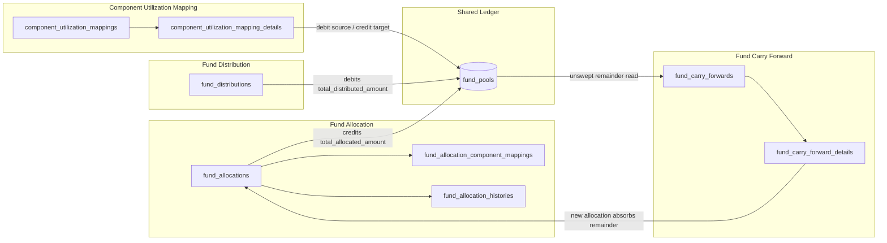
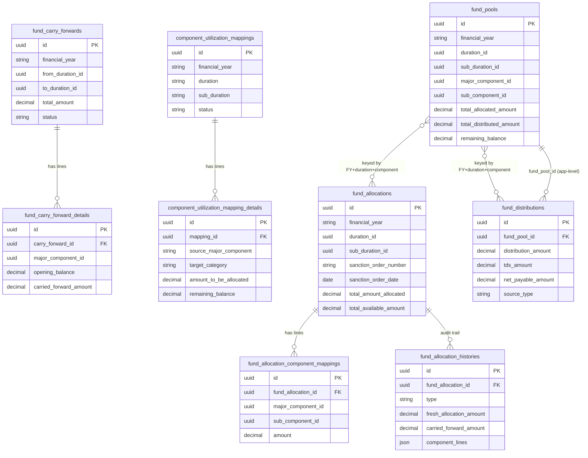

# Fund Flow / Fund Allocation / Fund Distribution / Component Utilization — Technical Analysis

**Application:** MSME/Scheme Fund Management Portal (Laravel 10, `c:\xampp\htdocs\team47`)
**Scope:** Reverse engineering, database design, loophole/bug audit, remediation plan, API reference, and worked carry-forward scenario for the four fund-management modules.
**Method:** Static analysis of every controller/service/action/request/model/migration file in the four module trees, cross-checked against `routes/web/*.php` to determine what is actually reachable in production versus dead/legacy code. Table shapes were taken from Laravel migrations where they exist, and otherwise reconstructed from Eloquent `$fillable`/`$casts` and raw `DB::table()` query column lists (called out explicitly wherever a table has no migration).

---

## 0. Executive Summary

The four modules are **not four independent features** — they are stages of one money pipeline that all read/write a shared balance ledger table, `fund_pools`:

```
Fund Allocation  →  fund_pools (total_allocated_amount)
Component Utilization Mapping → moves money sideways between two fund_pools rows
Fund Distribution → fund_pools (total_distributed_amount)
Fund Carry Forward → sweeps unspent fund_pools balance from an old period into a new Fund Allocation
```

The codebase is in the middle of a **migration from an older schema to a newer one**, and the old code was never removed. As a result, for three of the four modules there are **two (in one case four) parallel, independently-maintained implementations** of the same feature sitting in the tree side by side — some dead (unrouted), some *partially* dead (some actions routed, others not), and in the Component Utilization module, **two competing controllers are registered under the identical URL prefix** and only survive by route-registration order.

Key findings that drive the rest of this document:

1. **The specific scenario the task asked about — "carry-forwarded amount should not be re-offered in the same period" — is actually implemented**, via a compute-on-read ledger subtraction (no status flag). It works correctly for a single sequential request, but has two real gaps: a **race condition** that allows the same money to be carried forward twice under concurrent submissions, and a **missing reversal** when the destination allocation that received the carry-forward is later deleted (§7 has the full worked example).
2. **Component Utilization Mapping has an over-utilization loophole**: the "remaining balance" a transfer is checked against is sent by the *client*, not recomputed server-side — so a user can move more money out of a component than is actually left in it.
3. **Almost none of the core tables (`fund_allocations`, `fund_pools`, `fund_distributions`, `fund_carry_forwards`, …) have a Laravel migration** — they exist only in the live production database. A fresh environment cannot be stood up from this repository alone.
4. **No controller in any of the four modules enforces authorization on the backend** (`FormRequest::authorize()` always returns `true`; no `guard()`/permission check on the mutating routes), even though a full permission table (`fund-allocation-create`, `Carry Forward View`, etc.) already exists and is seeded.
5. Money is handled as native PHP `float` throughout, with inconsistent rounding between call sites.

---

## 1. Module Landscape & Naming Map

Before reading any of the reverse-engineering sections, it is essential to understand that **the same English words are reused for unrelated code** in this repository. Misreading this map is the single easiest way to end up debugging (or worse, "fixing") the wrong file.

| Name you'll see | What it actually is | Live? |
|---|---|---|
| `App\Web\FundFlow\FundFlowController/Service` | Legacy predecessor of today's Fund Allocation screen. Internally calls itself "allocation" (module key `fund-allocations`). | Partially — 3 of its 8 endpoints are live routes; `index/create/edit/store` are unrouted dead code. |
| `App\Domain\FundFlow\*` (namespace folder) | **Not** related to the controller above at all. This folder actually contains one of the two competing **Component Utilization Mapping** implementations, plus one unused helper (`FundFlowHelper`). | The controller here (`ComponentUtilzationMappingController`, typo preserved in the real filename) is partially live — see §1's Component Utilization row. |
| `routes/web/flow_management.php` / `FlowManagementController` | A workflow/approval-engine admin screen (roles, workflow states/transitions). Shares only the English word "flow". | Unrelated to fund modules — excluded from this document. |
| `App\Domain\FundAllocation\*` | **The live Fund Allocation module** (this document's primary subject for "Fund Allocation"). | Fully live, routed via `routes/web/fund-flow.php`. |
| `App\Web\Allocation\*` (`AllocationController`, `PoolService`) | A **second, separate, fully live** Fund Allocation implementation, writing to different tables (`allocation_headers`/`allocation_lines`), routed via `routes/web/allocation.php`. **`PoolService` here is shared** — it owns the `fund_pools` ledger used by every module in this document. | Fully live. |
| `App\Domain\FundDistribution\*` | The live Fund Distribution module. | Fully live, routed via `routes/web/fund-flow.php`. |
| `App\Web\FundFlow\FundDistributionController/Service` | An earlier Fund Distribution draft targeting a `fund_distribution` (singular) table that **no longer exists** in the live database. | Dead — imported but never bound to a route. |
| `App\Web\FundDistribution\DistributionController` | A third Fund Distribution draft. | Dead — its route file is `require_once`'d but the line is commented out. |
| `App\Web\FundDistribution\ClaimDistributionService/Processor/...` | A fourth, fully-built "waterfall" auto-distribution engine for claims. | Dead — its only call site is commented out. |
| `App\Domain\ComponentUtilizationMapping\*` | One of two Component Utilization Mapping implementations. Matches the real migrated table schema. | **Shadowed** — see §1 detail below. |
| `App\Domain\FundFlow\ComponentUtilizationMapping*` (the folder named `FundFlow`) | The other Component Utilization Mapping implementation. Uses column names that don't exist in the real schema. | **Wins the route collision for the main page**, but its edit/show/list sub-routes remain live too and will error if hit. |
| `App\Domain\FundCarryForward\*` | The Fund Carry Forward module. | Read-only screens (`index`, `list`, `show`) are live; the entire manual create/edit engine (`StoreFundCarryForwardAction`) is fully built but **unrouted**. The only way carry-forward actually happens in production is an automatic sweep triggered from inside Fund Allocation's `store()`. |
| Any `*-old` sibling folder (`FundAllocation-old`, `FundDistribution-old`, `FundCarryForward-old`, `FundFlow-old`, `ComponentUtilizationMapping-old`) | Byte-for-byte or near-identical backup snapshots left in place from a previous refactor, declaring the **same namespace and class names** as the live code. | Not autoloaded/reachable today (PSR-4 path mismatch), but a landmine — see §4.12. |

---

## 2. Reverse Engineering

### 2.1 Fund Flow (legacy — predecessor of Fund Allocation)

**Files:** `app/Web/FundFlow/FundFlowController.php`, `FundFlowService.php`, `FundFlowRequest.php`, `app/Rules/UniqueFundFlow.php`, routed from `routes/web/fund-flow.php`.

**Role.** A CRUD screen for a fund-allocation header (financial year, free-text duration, sanction order, total amount, document) plus component-split rows, writing to `fund_allocations` + `fund_allocations_map`. It is the direct ancestor of today's `App\Domain\FundAllocation` module, which now writes the *same physical header table* but with different column names (`duration_id`/`sub_duration_id` instead of free-text `duration`/`duration_limit`) and a different splits table (`fund_allocation_component_mappings` instead of `fund_allocations_map`).

**What's actually reachable:**

| Endpoint | Route | Live? |
|---|---|---|
| `uploadAllocationdocument()` | `POST /upload-allocation` | Yes — **no permission guard** |
| `deleteAllocationDocument()` | `POST /allocation-delete-documents` | Yes — **no permission guard**, takes a raw client-supplied file ID |
| `getTotalAllocation()` | `POST /get-total-allocation` | Yes — sums `fund_allocations_map` + legacy `fund_distribution` table |
| `index / create / edit / store / getAllocationList` | — | **Not routed** (dead) |
| `getDetails()` / `getAllocationDetail()` | — | Not routed on this controller directly, but re-used by `MisReportController` for the "Fund Allocation/Distribution Report" screens — **not dead**, just reached indirectly |

**Validation** (`FundFlowRequest::getRules()`): financial year regex `^\d{4}-\d{4}$`; `duration` any alphabetic string (no whitelist); amounts validated as **string regex**, not numeric bounds; a `UniqueFundFlow` duplicate-row check exists and is **fully implemented but commented out of the rule set**.

### 2.2 Fund Allocation (`App\Domain\FundAllocation`)

**Files:** `FundAllocation.php` (model), `FundAllocationComponentMapping.php`, `FundAllocationHistory.php`, `FundAllocationController/Service/DTO/Request/Resource`, `StoreFundAllocationAction`, `DeleteFundAllocationAction`, `ListFundAllocationAction`. Routed from `routes/web/fund-flow.php` under `/fund-allocation*`.

**Role.** Sanctions a pool of money for a (Financial Year, Duration, optional Sub-Duration), split across Major/Sub Component lines. Every save is journaled, append-only, to `fund_allocation_histories`. This is where the **automatic carry-forward sweep** lives (see §7).

**Balance formula — `FundAllocationService::getComponentBalance()`** (the single source of truth reused everywhere a "how much is left" figure is shown):

```
current_balance = max(0,
      directly_allocated
    + received_via_component_utilization
    − transferred_away_via_component_utilization
    − distributed
    − carried_forward_away
)
```

**`StoreFundAllocationAction::execute()`** (wrapped in one `DB::transaction()`), three modes:
1. **Edit** — reverses the old pool impact, guards against reducing a component below what's already been distributed/consumed (`assertReductionsDoNotUnderrunConsumedAmounts`), then re-applies.
2. **Create, merge into existing period** — if a header already exists for the exact (FY, duration, sub-duration), tops it up rather than creating a duplicate sibling row.
3. **Create, new period, `apply_carry_forward = true`** — runs `resolveCarryForwardSourcePeriods()` to find every earlier period eligible to feed this one, sums their still-unswept remainder, adds it into the new header's total, and journals it to `fund_carry_forwards`/`fund_carry_forward_details`.

**`DeleteFundAllocationAction::execute()`** refuses to delete if any mapped component has already been distributed against, or already had money moved out of it via Component Utilization Mapping. If clear, it reverses each mapping's pool contribution and deletes — but (see §4) it **never touches `fund_carry_forward_details`**, even when the allocation being deleted was itself the destination of a carry-forward sweep.

### 2.3 Fund Carry Forward (`App\Domain\FundCarryForward`)

**Files:** `FundCarryForward.php`, `FundCarryForwardDetail.php`, `FundCarryForwardController/Service/DTO/Request/Resource`, `StoreFundCarryForwardAction`, `ListFundCarryForwardAction`. Routed from `routes/web/fund-flow.php` under `/carry-forward-mapping*`.

**Role.** By design, this module is a **read-only audit trail** for the automatic sweep described in §2.2/§7 — the code comment at the top of its route block says so explicitly. `index`, `getDataTable`, and `show` are the only routed actions. A full manual create/edit engine (`StoreFundCarryForwardAction`, letting an operator move an arbitrary amount from an explicit "from period" to an explicit "to period") exists and is completely implemented, but **no route reaches `store`, `create`, `edit`, or `getClosingBalances`** — it is dead code today. Notably, this dead path has **no eligibility check at all**: it would accept any `carried_forward_amount` a caller supplies, capped only by a regex format rule, not compared to any live balance.

`FundCarryForwardDetail` uses a sentinel constant `UNALLOCATED_COMPONENT = '00000000-0000-0000-0000-000000000001'` in place of `NULL` to represent a header-level (not component-specific) carry-forward line, because the column is documented as NOT NULL.

### 2.4 Fund Distribution (`App\Domain\FundDistribution`)

**Files:** `FundDistribution.php` (model, `HasUuids` + `SoftDeletes`), `FundDistributionController/Service/DTO/Request/Resource`, `StoreFundDistributionAction`, `DeleteFundDistributionAction`, `ListFundDistributionAction`, `ListFundDistributionTransactionsAction`. Routed from `routes/web/fund-flow.php` under `/fund-distributions*`.

**Role.** Records a sanction order that releases money out of a component's `fund_pools` balance. There is no separate "beneficiary" entity — a distribution row is a ledger line, not a payment-to-a-party record. There is also **no separate `fund_distribution_transactions` table** — a "transaction" (as surfaced by `ListFundDistributionTransactionsAction`) is simply an individual `fund_distributions` row filtered to one component/period, drilled into from the aggregated group view (`ListFundDistributionAction`, which is grouped by `financial_year + major_component_id + sub_component_id`, sourced from `fund_pools`).

**`StoreFundDistributionAction::execute()`**, inside `DB::transaction()`, row-locks the pool (`SELECT ... FOR UPDATE`), refuses to proceed if no allocation pool exists yet or is `<= 0`, computes `tds_amount = amount * tds% / 100` and `net_payable = amount - tds_amount`, and on create/edit checks `projected_remaining = allocated − (distributed ± delta)`; if negative, throws and the transaction rolls back. This is the module's balance guard, and it is **entirely application-level** (no DB check constraint).

Distributions can also be created automatically from a batch-payment flow (`App\Domain\Batch\ClaimDistribution::distribute()`) — this path is live and is the source of Finding L1/L2 in §4.

### 2.5 Component Utilization Mapping

**Files (live-ish, "Implementation A"):** `app/Domain/ComponentUtilizationMapping/ComponentUtilizationMapping.php`, `...Detail.php`, `Controller/Request/Service`. **Files (competing, "Implementation B"):** `app/Domain/FundFlow/ComponentUtilizationMapping.php`, `...Detail.php`, `ComponentUtilzationMappingController.php` (typo preserved), `ComponentUtilizationMappingDTO/Request/Resource/Service`, `ListComponentUtilizationMappingAction`, `StoreComponentUtilizationMappingAction`.

**Role.** Lets an admin move unspent balance sideways: "Source Major/Sub Component X (Allocated A, Released R, Remaining A−R) → transfer `amount_to_be_allocated` → Target Category/Sub-Component Y", for a given (Financial Year, Duration, Sub-Duration). This runs **after** allocation and distribution — it reroutes leftover money between components, it is not an expense/claim-level "utilization". `ComponentUtilizationMappingService::storeMapping()` (Implementation A) does, inside one `DB::transaction()`: find-or-create the header row, insert a detail line with the client-supplied amount snapshot, then debit the source pool and credit the target pool via the shared `PoolService`.

**Which implementation actually runs — the route-collision:** both `routes/web/fund-flow.php` (registers Implementation B first) and `routes/web/component-utilization.php` (registers Implementation A second) bind `GET/POST /component-utilization-mapping[...]` under the *identical* prefix, inside `routes/web.php`. Laravel's route table is a flat associative array keyed by `method+URI` — **last registration wins**, so `GET /component-utilization-mapping` and `POST /component-utilization-mapping/store` resolve to **Implementation A** (confirmed to be the one matching the real migrated schema). But Implementation B's other sub-routes (`/create`, `/datalist`, `/component-balances`, `/store/{id}`, `/{id}/edit`, `/{id}`) are **not** re-registered by A, so they remain bound to **Implementation B** — which references model columns (`duration_id`, `target_major_component_id`, `eligible_major_component_id`, `max_utilization_amount`, …) that **do not exist** in the live migration. Any real request to those sub-routes will throw a SQL "Unknown column" error.

Master-data note: neither implementation touches the dedicated `components`/`major-components`/`sub-components` CRUD tables (those back an unrelated feature). Both resolve "components" through the generic `attribute_values` EAV table, typed via `attributes.code`.

---

## 3. Database Design

### 3.1 Cross-module data-flow diagram



### 3.2 Entity-relationship diagram



### 3.3 Table-by-table schema

Only two tables in this entire domain have a real Laravel migration. Everything else was created directly against the production database (`team_portal47`) and is reconstructed below from model/query analysis — **flagged explicitly** wherever no migration exists.

**`fund_allocation_histories`** — *migrated* (`2026_07_30_170000_create_fund_allocation_histories_table.php`), append-only:

| Column | Type | Null | Default | Notes |
|---|---|---|---|---|
| id | uuid PK | No | — | |
| fund_allocation_id | uuid | No | — | FK → `fund_allocations.id`, `ON DELETE CASCADE` |
| financial_year | string | No | — | |
| duration_id / sub_duration_id | uuid | **Yes** | null | ⚠ nullable despite identifying the period |
| type | string | No | `create` | `create` \| `edit` \| `topup` |
| fresh_allocation_amount | decimal(15,2) | No | 0 | |
| carried_forward_amount | decimal(15,2) | No | 0 | |
| component_lines | json | Yes | null | cast to array; snapshot of line items |
| total_amount_allocated_after / total_available_amount_after | decimal(15,2) | No | 0 | |
| sanction_order_number / date | string / date | Yes | null | |
| created_by | uuid | Yes | null | no FK |

**`component_utilization_mappings`** — *migrated* (`2026_07_27_063800_...`):

| Column | Type | Null | Default |
|---|---|---|---|
| id | uuid PK | No | — |
| financial_year | string | No | — |
| duration / sub_duration | string | Yes | null |
| status | string | No | `Active` |
| created_by / updated_by | uuid | Yes | null |

Only a primary key exists — **no unique index on `(financial_year, duration, sub_duration)`** despite the header being looked up by exactly that triple.

**`component_utilization_mapping_details`** — *migrated* (`2026_07_27_063900_...`):

| Column | Type | Null | Default |
|---|---|---|---|
| id | uuid PK | No | — |
| mapping_id | uuid | No | — | FK → mappings, `ON DELETE CASCADE` |
| source_major_component / source_sub_component | string | **Yes** | null | *(app validation requires them — schema/validation mismatch)* |
| allocated_amount / released_amount / remaining_balance / amount_to_be_allocated | decimal(15,2) | No | 0 |
| target_category / target_sub_component | string | Yes | null |
| status | string | No | `Active` |

**Not migrated anywhere — reconstructed from code:**

| Table | Key columns | Notes |
|---|---|---|
| `fund_allocations` | id, financial_year, duration_id, sub_duration_id, sanction_order_number/date, document_path, remarks, total_amount_allocated, total_available_amount, created_by/updated_by | `total_available_amount` is added to the table **at runtime** by application code the first time it's missing (see §4-M9) |
| `fund_allocation_component_mappings` | id, fund_allocation_id, major_component_id, sub_component_id, amount | No DB FK to `fund_allocations` confirmed |
| `fund_pools` | id, financial_year, duration_id, sub_duration_id, major_component_id, sub_component_id, opening_balance, carry_forward_in/out, available_amount, total_allocated_amount, total_distributed_amount, remaining_balance | **The** shared ledger. No unique constraint on its natural key |
| `fund_distributions` | id, financial_year, duration_id, sub_duration_id, major_component_id, sub_component_id, fund_pool_id, source_type (`enum: MANUAL,CLAIM,WORKSHOP`), distribution_amount, tds_percentage, tds_amount, net_payable_amount, sanction_order_number/date, deleted_at | No FK constraints at all; `source_type` enum is missing a `BATCH` value that live code inserts (§4-D1) |
| `fund_carry_forwards` | id, financial_year, from_duration_id/from_sub_duration_id, to_duration_id/to_sub_duration_id, carry_forward_date, total_amount, remarks, status | `status` value casing differs between the two write paths (`Completed` vs `COMPLETED`) |
| `fund_carry_forward_details` | id, carry_forward_id, major_component_id (NOT NULL, sentinel `00000000-0000-0000-0000-000000000001` for header-level lines), sub_component_id, opening_balance, carried_forward_amount, remarks | |
| `allocation_headers` / `allocation_lines` | Same shape as `fund_allocations`/`fund_allocation_component_mappings` but belonging to the **separate, parallel** `App\Web\Allocation` implementation | Only a 2024 `ALTER TABLE ADD opening_balance` migration exists for `allocation_headers`; the `CREATE TABLE` is missing |
| `fund_allocations_map` | id, allocation_id, financial_year, amount, major_component_id, component_id, sub_component_id | Legacy splits table used only by the Fund Flow module (§2.1) |
| `fund_distribution` (singular) | id, financial_year, duration, duration_limit, major_component_id, sub_component_id, amount_allocated | Legacy table, **no longer exists** in the live DB — any code path still querying it will hard-fail |
| `components` / `major-components` / `sub-components` | id, name/slug, status, (major_component_id / component_id on the child tables) | Master data for an *unrelated* feature — not used by any fund module; no migration |
| `attributes` / `attribute_values` | id, code / id, attribute_id, parent_id, attribute_value, status | The **actual** master data every fund module resolves "duration"/"major component"/"sub component" through (generic EAV table) |

### 3.4 Foreign-key coverage

Only **two** foreign keys in this entire domain are enforced at the database level:
- `fund_allocation_histories.fund_allocation_id → fund_allocations.id` (cascade delete)
- `component_utilization_mapping_details.mapping_id → component_utilization_mappings.id` (cascade delete)

Every other relationship listed in §3.2/§3.3 (roughly twenty of them) is **application-level only** — enforced by matching column values in query builders, never by a DB constraint. Combined with the missing-migration problem, this is the top schema-design gap in the whole module (see §4, Finding S1).

---

## 4. Loopholes, Bugs & Architectural Risks

Findings are grouped by theme; each has a resolution in §5 under the matching ID.

### 4.1 Financial-integrity bugs (highest priority)

| ID | Module | Finding |
|---|---|---|
| **F1** | Component Utilization | **Over-utilization loophole.** `ComponentUtilizationMappingRequest` validates `amount_to_be_allocated <= remaining_balance`, but `remaining_balance` is a plain client-supplied field, never recomputed server-side inside `storeMapping()`. Combined with `PoolService::recalculateBalance()` explicitly *not* clamping at zero ("overdraft allowed" per its own inline comment, contradicting its docblock), a crafted or stale-tab request can drive a component's pool negative with no rejection. |
| **F2** | Fund Distribution | `App\Domain\Batch\ClaimDistribution::distribute()` inserts `distribution_amount` as **negative** when no matching allocation exists for the batch's period, bypassing `StoreFundDistributionAction`'s "remaining cannot go negative" guard entirely (that guard is only in the manual UI path). The only signal is a flash message a user can miss. |
| **F3** | Fund Distribution | Same method inserts `source_type = 'BATCH'` into a column that is a MySQL `enum('MANUAL','CLAIM','WORKSHOP')`. Under the live DB's non-strict SQL mode this is silently coerced to an empty string rather than rejected — every such row becomes invisible to any `source_type` filter/report. |
| **F4** | Fund Allocation / Carry Forward | **Race condition enabling real double carry-forward.** The eligibility computation (`getUnallocatedRemainderForPeriod`, `getUndistributedAmountsByComponent`) is a set of unlocked `SELECT`s; only the final `fund_pools` row update takes a lock. Two concurrent "create allocation with carry-forward" requests against the same source period can both read the same unswept remainder before either commits its ledger row, and both will carry the same money forward. Full trace in §7. |
| **F5** | Fund Allocation | **Deleting a carry-forward destination doesn't reverse the sweep.** `DeleteFundAllocationAction` reverses the deleted allocation's own component-mapping pool contributions, but never touches `fund_carry_forward_details`. Since the source period's "already carried" subtraction reads *all* matching ledger rows regardless of whether their destination still exists, the swept money is permanently unavailable once its destination is deleted. Full trace in §7. |
| **F6** | Fund Carry Forward | The fully-built manual carry-forward path (`StoreFundCarryForwardAction`) has **no eligibility check whatsoever** — it accepts any amount typed into the form. It is unrouted today, but it is real code that a future route addition could expose with this gap intact. |
| **F7** | Component Utilization | **Duplicate-submission double-spend.** The anti-duplicate-mapping validator runs a plain `->exists()` check at validation time, separate from the actual insert; two near-simultaneous identical submissions can both pass validation before either commits, producing two detail rows and double-applying the same transfer. No unique constraint backs this up. |
| **F8** | Fund Allocation | `assertReductionsDoNotUnderrunConsumedAmounts` correctly blocks *edits* that would reduce a component below what's already consumed — but `allocation_lines.*.amount` is validated `nullable` (not `required`) on edit, so a malformed/partial edit payload can silently zero out a line's amount before that guard even sees a meaningful value, for components that haven't yet been consumed. |

### 4.2 Missing / bypassable authorization

| ID | Finding |
|---|---|
| **A1** | `FundAllocationRequest::authorize()`, `FundCarryForwardRequest::authorize()`, and `ComponentUtilizationMappingRequest::authorize()` all unconditionally `return true`. |
| **A2** | No controller in Fund Allocation, Fund Carry Forward, or Component Utilization Mapping calls `guard()`/`can:` on any mutating action — only the blanket `auth` middleware applies. A fully-seeded permission table (`fund-allocation-create`, `Fund-allocation-edit`, `Carry Forward Create`, …) exists and is wired to menu visibility, but **not** to the backend endpoints — any authenticated user of any role can create/edit/delete regardless of their assigned permissions. |
| **A3** | `FundDistributionController::destroy()` and `edit()` both check the **create** permission (`fund-distribution-create`) — there is no distinct delete permission defined anywhere, so anyone who can create distributions can also permanently remove them. |
| **A4** | Fund Flow's live document-upload/delete endpoints (`uploadAllocationdocument`, `deleteAllocationDocument`, `getTotalAllocation`) have no `guard()` call at all, unlike the module's own `index/create/edit` actions. |
| **A5** | Fund Flow's `deleteAllocationDocument()` forwards the entire raw request body straight to a file-deletion routine keyed off a client-supplied `id`, with no ownership check and no path-traversal sanitization before the ID is concatenated into a filesystem path — a plausible arbitrary-file-deletion/IDOR vector, compounded by A4. |

### 4.3 Duplicate / dead / conflicting implementations

| ID | Finding |
|---|---|
| **D1** | **Two live, fully-routed Fund Allocation implementations** exist simultaneously: `App\Domain\FundAllocation` (`fund_allocations`/`fund_allocation_component_mappings`) and `App\Web\Allocation` (`allocation_headers`/`allocation_lines`), both feeding the same `fund_pools` ledger. Which one a given period's true balance reflects depends on which UI was used to create it. |
| **D2** | **Component Utilization Mapping route collision**: Implementation A (matches real schema) and Implementation B (references non-existent columns) are both registered under the identical `/component-utilization-mapping` prefix; A wins the main list/create routes only because its route file loads second, while B's edit/show/list-detail sub-routes remain live and will throw SQL errors if hit. |
| **D3** | **Four parallel Fund Distribution code trees**: the live `App\Domain\FundDistribution`, a dead `App\Web\FundFlow\FundDistributionController` (targets a table that no longer exists), a dead `App\Web\FundDistribution\DistributionController` (its route file is commented out, not deleted), and a dead-but-fully-wired `ClaimDistributionService/Processor` engine. |
| **D4** | The Fund Flow module's own `store()` action writes column names (`duration`, `duration_limit`, `sanction_order_no`) that don't match what the live `FundAllocation` model expects on the very same table (`duration_id`, `sub_duration_id`, `sanction_order_number`) — currently harmless only because `store()` isn't routed; re-wiring or copying that action would resurrect real data corruption. |
| **D5** | Five `*-old` sibling directories (§1) declare the same PHP namespace and class names as live code. They're inert under this project's pure-PSR-4 autoloading today, but would cause a fatal "cannot redeclare class" error the moment any tool globs and requires all `.php` files, or a `classmap` autoload entry is ever added. |
| **D6** | `UniqueFundFlow` (§2.1) is fully implemented but disabled, and even if re-enabled would only enforce uniqueness at the application layer — no DB unique constraint backs the same rule. |

### 4.4 Schema & migration gaps

| ID | Finding |
|---|---|
| **S1** | Of roughly 20 tables touched by these four modules, only **two** have a Laravel migration (`fund_allocation_histories`, `component_utilization_mappings`/`_details`). Everything else — `fund_allocations`, `fund_pools`, `fund_carry_forwards`, `fund_distributions`, `allocation_headers`, the master-data tables — exists only in the live production database. A fresh environment cannot be built from `php artisan migrate` alone. |
| **S2** | No unique constraint on `fund_pools`' natural key `(financial_year, duration_id, sub_duration_id, major_component_id, sub_component_id)` — the find-or-create pattern used everywhere this table is touched is a straight race condition waiting to duplicate the balance-of-record row. |
| **S3** | No unique constraint on `component_utilization_mappings`' natural key `(financial_year, duration, sub_duration)`, despite the header being looked up by exactly that triple via `firstOrNew()` with no row lock. |
| **S4** | `fund_allocation_histories.duration_id`/`sub_duration_id` are nullable even though they identify which period an audit row belongs to — a malformed insert can silently vanish from period-scoped queries/reports. |
| **S5** | `component_utilization_mapping_details.source_major_component`/`source_sub_component` are nullable at the DB layer but required by application validation — a latent contract mismatch if any other write path (a script, a future migration, a bulk import) bypasses the FormRequest. |
| **S6** | `document_path`/`upload_document` columns are polymorphic-by-convention — they hold either a `file_uploads.id` or a `file_uploads.file_system_name`, resolved via `WHERE id = ? OR file_system_name = ?`. No FK is possible against a column with two meanings, and a collision (a `file_system_name` string equal to another row's `id`) resolves to the wrong file. |
| **S7** | `App\Domain\FundFlow\ComponentUtilizationMappingDetail` / `FundCarryForwardService::getClosingBalances()` reference columns (`target_major_component_id`, `eligible_major_component_id`, `max_utilization_amount`, `total_max_utilization_amount`) that exist in **no** migration for these tables at all — dormant only because the code paths that use them are unrouted. |
| **S8** | Explicit `COLLATE utf8mb4_unicode_ci` casts are required in several joins between these tables (e.g. the Component Utilization duplicate-mapping check) — a sign of collation drift between tables that any future join written without the same cast will hit as an "Illegal mix of collations" error. |

### 4.5 Operational / runtime-safety issues

| ID | Finding |
|---|---|
| **M9** | `FundAllocationService::getPeriodSummary()` runs a live `Schema::table(...)->decimal(...)` **ALTER TABLE from inside a normal GET request handler** the first time `total_available_amount` is found missing, immediately followed by a raw `UPDATE ... LEFT JOIN fund_allocations_map` backfill that references a **stale table name** (the real mapping table is `fund_allocation_component_mappings`, joined on a different key) — the backfill silently computes wrong (usually zero) values, and the ALTER itself will hard-fail under any DB user without `ALTER` privilege, or race with a second concurrent first-request. |
| **M10** | `deleteDocuments()` in the Fund Flow service can execute with an **undefined `$path` variable** when `document_type` isn't the literal string `'upload'`, since the `if` branch that assigns `$path` isn't paired with an `else`. |
| **M11** | Several `->get()` calls with no `limit`/pagination exist on hot paths: `FundFlowService::getAllocationList()`'s non-paginated branch, `ComponentUtilizationMappingService::getMappingHistory()` (loads the *entire* details table on every index-page load), and `getUtilizedComponents()` (loads *every* allocation header + line in the system on every preview request, with no financial-year filter pushed to the query). |
| **M12** | N+1 (or N+1-equivalent) query patterns: `getFundAllocationViewDetails()` calls the 6-query `getComponentBalance()` inside a `->map()` over every line of the allocation being viewed; the carry-forward sweep does the same per source period, *inside the open write transaction*, extending lock hold time; `getUtilizedComponents()` runs up to 3 extra queries per allocation line plus one query per major component for its target dropdown. |
| **M13** | Exceptions are returned to the browser verbatim in at least two JSON error responses (`ComponentUtilizationMappingController::store()`, Fund Allocation's `store()` catch block) — potential leakage of SQL fragments, column names, or file paths. |

### 4.6 Data-quality / consistency issues

| ID | Finding |
|---|---|
| **Q14** | `fund_carry_forwards.status` is written as `'Completed'` by the automatic sweep and `'COMPLETED'` by the (unrouted) manual path — any exact-match filter/report will silently miss whichever path it wasn't tested against. |
| **Q15** | Money fields are handled as native PHP `float` end-to-end (model casts, DTOs, service arithmetic) rather than a decimal-safe type, with **inconsistent rounding**: `StoreFundDistributionAction` computes TDS with no explicit rounding while the dormant `ClaimDistributionProcessor` does `round(..., 2)` for the identical formula. |
| **Q16** | `Components`/`MajorComponents` models cast the same logical `status` field to `boolean` and `int` respectively — inconsistent typing for the same concept across sibling master-data models. |
| **Q17** | The dedicated `components`/`major-components`/`sub-components` tables and the generic `attribute_values` EAV rows typed `major-components`/`sub-components` share **textually identical names** for two completely unrelated systems — a strong contributor to how Implementation B of Component Utilization Mapping ended up targeting the wrong schema in the first place. |

---

## 5. Resolutions

Each item below is keyed to the matching finding ID in §4.

**F1 — Over-utilization (Component Utilization).** Recompute `allocated_amount`/`released_amount`/`remaining_balance` server-side from `fund_pools` inside `storeMapping()`, inside the same locked transaction that performs the transfer — never trust the client's snapshot for anything that gates a write. Add `max(0, ...)` clamping (or a hard exception) to `PoolService::recalculateBalance()` and correct its misleading docblock either way.

**F2/F3 — Batch distribution bypass & invalid enum.** Add `'BATCH'` to the `fund_distributions.source_type` enum via a proper migration (or route batch-originated rows through the same `MANUAL` value with a separate `source_id` tag, if a fourth enum value isn't desired). Remove the negative-amount workaround in `ClaimDistribution::distribute()`; if no allocation pool exists yet, that should be a hard validation failure surfaced to the finance user, not a silently-negative ledger entry.

**F4/F5 — Carry-forward race & delete-doesn't-reverse.** (Full remediation detail in §7.) In short: take a row lock on every source period's `fund_pools` row(s) *before* computing carry-forward eligibility (not just at the final pool-update step), so the eligibility read and the ledger write happen against a serialized view. On `DeleteFundAllocationAction`, add a step that finds and reverses any `fund_carry_forward_details` rows whose sweep fed the allocation being deleted, crediting the amount back to the source period (or block the delete if the carried-forward money has already been spent downstream, mirroring the existing "can't delete if distributed" guard).

**F6 — Unguarded manual carry-forward.** Either delete this dead code outright (lowest risk, since the automatic sweep is the only supported mechanism per the module's own code comment) or, if a manual override is genuinely needed, wire `StoreFundCarryForwardAction` through the same `getCarryForwardEligibleAmount()` check the automatic path uses before it's ever routed.

**F7 — Duplicate-submission double-spend.** Add a unique DB constraint on `component_utilization_mapping_details (mapping_id, source_major_component, source_sub_component, target_category, target_sub_component)` (or an equivalent generated hash column) so the second of two racing inserts fails at the database layer regardless of what the pre-check saw.

**F8 — Edit-mode amount validation gap.** Make `allocation_lines.*.amount` `required` on edit too (or add an explicit application-level check that a submitted line's amount is never silently treated as zero) so a malformed payload is rejected rather than accepted with `amount ?? 0`.

**A1–A5 — Authorization.** Wire `authorize()` on every FormRequest in scope to a real `Gate`/permission check matching the already-seeded permission slugs; add `guard('<permission-slug>')` to every mutating controller action across all four modules (Fund Allocation, Fund Carry Forward, Fund Distribution, Component Utilization Mapping), following the pattern the master-data controllers (`Components`, `MajorComponents`) already use. Add a dedicated `fund-distribution-delete` permission distinct from `fund-distribution-create`. For the Fund Flow document-delete endpoint, add a permission guard, look up the `file_uploads` row by ID first and verify it belongs to the allocation being edited before deleting anything, and reject any ID that doesn't resolve to an existing owned row.

**D1 — Two Fund Allocation implementations.** Pick one canonical implementation (recommend `App\Domain\FundAllocation`, since it already has the richer duration/sub-duration/carry-forward model) and migrate `allocation_headers`/`allocation_lines` data into `fund_allocations`/`fund_allocation_component_mappings`; then decommission `App\Web\Allocation`'s controller/routes. Until that migration happens, treat `PoolService::rebuildAllPools()`'s reconciliation logic as the authoritative tie-breaker and document it clearly, since it is currently the only thing keeping both implementations' numbers consistent.

**D2 — Component Utilization route collision.** Delete (or explicitly 410-Gone) every route bound to Implementation B (`App\Domain\FundFlow\ComponentUtilzationMappingController`) rather than relying on registration order to hide it — registration-order shadowing is exactly the kind of thing that silently breaks the next time route files are reordered. Then either remove Implementation B's classes entirely or clearly mark them deprecated so nobody extends them.

**D3 — Four Fund Distribution trees.** Delete `App\Web\FundFlow\FundDistributionController/Service/Request` (targets a dropped table, cannot function). Delete or clearly mark `App\Web\FundDistribution\DistributionController` and its now-orphaned `routes/web/fund_distribution.php`. For the claim-distribution "waterfall" engine, either finish and route it properly (restoring the commented-out insufficient-funds guard first) or remove it if the batch-payment flow's simpler negative-amount approach (once fixed per F2) is the intended long-term design.

**D4/D6 — Fund Flow schema drift & disabled uniqueness rule.** Given Fund Flow's `store()`/`create/edit` actions are already unrouted, the lowest-risk fix is to delete them outright rather than leave a schema-incompatible landmine sitting next to the live module. If the module must stay for its currently-live document-upload/`getTotalAllocation` endpoints, strip the dead `store/create/edit/index` methods and the entire `UniqueFundFlow` machinery out, and add the DB-level unique constraint the disabled rule was trying to approximate.

**D5 — `*-old` folders.** Delete them. They serve no runtime purpose today and are a pure liability if the autoloading strategy ever changes.

**S1–S8 — Schema/migration gaps.** Generate migrations for every un-migrated table listed in §3.3 by diffing the live production `SHOW CREATE TABLE` output against this document (start with `fund_allocations`, `fund_pools`, `fund_distributions`, `fund_carry_forwards`/`_details`, `allocation_headers`/`allocation_lines` — the money-bearing ones), and check them into version control so a fresh environment is reproducible. While authoring those migrations, add the missing pieces this audit found: unique constraints on `fund_pools`' and `component_utilization_mappings`' natural keys (S2/S3), `NOT NULL` on `fund_allocation_histories.duration_id`/`sub_duration_id` (S4), matching nullability between `component_utilization_mapping_details` and its validation rules (S5), and a consistent collation across all tables in this domain so the ad hoc `COLLATE` casts (S8) can be removed. For S6 (polymorphic document columns), split into two explicit columns (`file_upload_id` with a real FK, deprecate the filename-fallback path) during the same migration pass. Delete the dead-code references to nonexistent columns (S7) as part of the D2/D3 cleanups above.

**M9 — Runtime ALTER TABLE.** Move the `total_available_amount` column addition into a proper migration (it should already exist in production by now, so the migration can simply be a no-op `hasColumn` guard for idempotency) and replace the raw backfill `UPDATE` with a one-off Artisan console command that joins the *correct* table (`fund_allocation_component_mappings`), run once during deployment — never DDL from a request thread.

**M10 — Undefined variable.** Add an `else` branch (or a default `$path = null` with an explicit early return) in Fund Flow's `deleteDocuments()`.

**M11/M12 — Unbounded queries & N+1s.** Add default pagination to `getAllocationList()`'s non-paginated branch and to `getMappingHistory()`; add a mandatory financial-year filter to `getUtilizedComponents()`'s base query instead of loading every allocation in the system; batch the repeated `getComponentBalance()` calls in `getFundAllocationViewDetails()` and the carry-forward sweep into one aggregate query per period rather than one set of 6 queries per component line.

**M13 — Exception leakage.** Log the full exception server-side (`Log::error(...)`) and return a generic, non-implementation-revealing message to the client in every catch block that currently forwards `$e->getMessage()` into a JSON response.

**Q14 — Status casing.** Normalize on one casing (recommend uppercase `COMPLETED` to match the manual path's existing convention, or introduce a proper enum/constant used by both writers) and backfill existing rows.

**Q15 — Float money handling.** Switch Eloquent `$casts` from `'float'` to `'decimal:2'` for every money column (this keeps values as fixed-precision strings through PHP, avoiding binary float drift), and centralize the TDS/net-payable rounding formula into one shared helper used by both `StoreFundDistributionAction` and `ClaimDistributionProcessor` so they can't drift apart again.

**Q16/Q17 — Naming/type inconsistencies.** Standardize the `status` cast (pick boolean or int, apply everywhere). Rename either the dedicated `components`/`major-components`/`sub-components` tables/models or the `attribute_values` "major-components"/"sub-components" `attributes.code` values so a repo-wide search for one doesn't surface the other; this is the single highest-leverage naming fix for preventing another Implementation-B-style schema mismatch in the future.

---

## 6. API / Function Reference

### 6.1 Fund Allocation — `App\Domain\FundAllocation\FundAllocationController`

| Method | Route | Purpose |
|---|---|---|
| `index()` | `GET /fund-allocations` | List page with FY/component/duration filters |
| `getDataTable()` | `GET /fund-allocation/datalist` | Server-side datatable feed for the list page |
| `create()` | `GET /fund-allocation/create` | Renders the create form |
| `uploadDocuments()` | `POST /fund-allocation/upload-documents` | Uploads a sanction-order supporting document (max 5MB) |
| `store()` | `POST /fund-allocation/store/{id?}` | Creates or edits a Fund Allocation header + component lines; runs the carry-forward sweep on create when requested |
| `destroy()` | `GET /fund-allocation-delete/{id}` | Deletes an allocation (blocked if any line has already been distributed/utilized) |
| `edit()` | `GET /fund-allocation/{id}/edit` | Loads edit-screen data |
| `show()` | `GET /fund-allocation/{id}` | Loads the full view/audit-history screen |
| `getAttributeValues()` | `GET /fund-allocation/attribute-values/{attributeId}` | Cascading dropdown lookup (duration/component values) |
| `viewDocument()` / `downloadDocument()` | `GET /fund-allocation/{id}/view-document`, `.../download-document` | Streams or downloads the attached sanction-order document |
| `getPeriodSummary()` | `GET /fund-allocation/period-summary` | Opening balance / existing-allocation note for the create form |
| `getComponentBalance()` | `GET /fund-allocation/component-balance` | Live "current allocation" figure for one component |
| `checkPreviousBalance()` | `GET /fund-allocation/check-previous-balance` | Powers the "carry forward available" popup |
| `getYearlyNoteBalance()` | `GET /fund-allocation/yearly-note-balance` | Whole-FY dynamic balance note for Yearly-duration allocations |

### 6.2 Fund Carry Forward — `App\Domain\FundCarryForward\FundCarryForwardController`

| Method | Route | Purpose |
|---|---|---|
| `index()` | `GET /carry-forward-mapping` | List page (read-only audit trail of automatic sweeps) |
| `getDataTable()` | `GET /carry-forward-mapping/datalist` | Datatable feed |
| `show()` | `GET /carry-forward-mapping/{id}` | Detail view of one carry-forward event and its component-level lines |
| `create()` / `store()` / `edit()` / `getClosingBalances()` | *(no route)* | Fully implemented manual carry-forward engine — dead code today (§2.3, §4-F6) |

### 6.3 Fund Distribution — `App\Domain\FundDistribution\FundDistributionController`

| Method | Route | Purpose |
|---|---|---|
| `index()` | `GET /fund-distributions` | List page |
| `getSummaryList()` | `GET /fund-distributions/api/summary-list` | Aggregated datatable, grouped by component/period |
| `showDetails()` | `GET /fund-distributions/drill/{fy}/{majorId}/{subId?}` | Drill-down card totals + per-duration breakdown for one group |
| `getGroupTransactions()` | `GET /fund-distributions/api/drill-list/{fy}/{majorId}/{subId?}` | Individual distribution rows within one group |
| `create()` | `GET /fund-distributions/create` | Renders the create form |
| `show()` | `GET /fund-distributions/{id}/show` | Single-record view with linked pool breakdown |
| `viewDocument()` | `GET /fund-distributions/{id}/document` | Streams the attached document |
| `edit()` | `GET /fund-distributions/{id}/edit` | Loads edit-screen data |
| `store()` | `POST /fund-distributions/store/{id?}` | Creates/edits a distribution; enforces the "cannot exceed allocated" balance guard |
| `destroy()` | `DELETE /fund-distributions/delete/{id}` | Soft-deletes and reverses the pool impact |
| `getRealTimePoolData()` | `POST /fund-distributions/api/fetch-pool` | Live pool snapshot for the create/edit form (unlocked read) |
| `uploadAsset()` | `POST /fund-distributions/api/upload-asset` | Uploads a supporting document |

### 6.4 Component Utilization Mapping — `App\Domain\ComponentUtilizationMapping\ComponentUtilizationMappingController`

| Method | Route | Purpose |
|---|---|---|
| `index()` | `GET /component-utilization-mapping` | History/listing page of all transfer events |
| `getUtilizedComponents()` | `POST /component-utilization-mapping/get-components` | Computes per-component allocated/released/remaining figures for the transfer form |
| `store()` | `POST /component-utilization-mapping/store` | Creates a transfer: debits the source component's pool, credits the target's |
| `getDurations()` / `getSubDurations()` | *(no route)* | Dead code — unreachable dropdown helpers |

### 6.5 Fund Flow (legacy, partially live) — `App\Web\FundFlow\FundFlowController`

| Method | Route | Purpose |
|---|---|---|
| `uploadAllocationdocument()` | `POST /upload-allocation` | Uploads a document for the legacy allocation form |
| `deleteAllocationDocument()` | `POST /allocation-delete-documents` | Deletes a previously uploaded document (§4-A5 flags this as unsafe) |
| `getTotalAllocation()` | `POST /get-total-allocation` | Sums legacy allocation + distribution tables for a component's remaining balance |
| `getDetails()` / `getAllocationDetail()` | *(reached only via `MisReportController`)* | Backing data for the MIS "Fund Allocation/Distribution Report" screens |
| `index()` / `create()` / `edit()` / `store()` / `getAllocationList()` | *(no route)* | Dead code (§2.1) |

---

## 7. Worked Example: Preventing a Carry-Forward Amount From Being Counted Twice

This section answers the scenario given in the task directly: *"If an amount is carried forward from a specific period, it should not be reflected in that same period again, because it has already been forwarded to another duration."*

### 7.1 How the app is supposed to behave, and mostly does

There is **no boolean flag anywhere** (no `is_carried_forward`, no `status='closed'`) marking a period or component as "already swept". Instead, the eligible-to-carry-forward amount is computed fresh on every read as:

```
eligible_remainder(period) = raw_unspent_remainder(period) − SUM(fund_carry_forward_details.carried_forward_amount
                                                                   WHERE it came FROM this exact period)
```

**Walkthrough:**

1. **Period A** (say, Q1 of FY 2025-2026, Component "Marketing") is allocated ₹1,00,000 and ₹60,000 has been distributed against it. Its live remaining balance, `getComponentBalance()`, is `1,00,000 − 60,000 = ₹40,000`.
2. A user creates a **new** allocation for **Period B** (Q2) with "Apply carry forward" checked. `StoreFundAllocationAction` calls `resolveCarryForwardSourcePeriods()`, finds Period A eligible, reads its `₹40,000` remainder, adds it into Period B's total, and — critically — writes a row to `fund_carry_forward_details`: `{from = Period A / Marketing, carried_forward_amount = 40,000}`. It also debits Period A's `fund_pools` row by ₹40,000.
3. Anyone now asking "what's left in Period A, Marketing?" — the create-allocation form for a hypothetical **Period C**, the List page, the View page — re-runs the same formula: `raw_unspent_remainder(A) = 40,000`, minus `already_carried(A) = 40,000` (the row from step 2), giving **₹0 eligible**. Period A's ₹40,000 is correctly never offered a second time. **This is the protection the task asked about, and for a single sequential request it works.**

### 7.2 Where it actually breaks

**Gap 1 — concurrency (Finding F4).** Suppose instead of one destination, two users simultaneously create Period B *and* Period C, both with carry-forward enabled from Period A, at nearly the same moment:

| Time | Request for Period B | Request for Period C |
|---|---|---|
| t0 | Reads Period A's eligible remainder → sees ₹40,000 (no carry-forward rows yet) | Reads Period A's eligible remainder → sees ₹40,000 (same — B hasn't committed yet) |
| t1 | Adds ₹40,000 to Period B's total; writes carry-forward ledger row #1; debits Period A's pool by ₹40,000; commits | Adds ₹40,000 to Period C's total; writes carry-forward ledger row #2; debits Period A's pool by another ₹40,000; commits |

Both requests read the *same* unswept remainder before either had written its ledger row, because only the final pool update is row-locked — the eligibility `SELECT`s that decide *how much* to carry are not. Result: **₹80,000 has been carried out of a period that only ever had ₹40,000 available**, split across two destinations, and Period A's pool balance is now overdrawn by ₹40,000 (which `PoolService::recalculateBalance()` will happily record as a negative number rather than reject, per Finding F1/Q15's related overdraft-allowed behavior).

**Gap 2 — deletion of the destination (Finding F5).** Continuing the *single-request* happy path from §7.1: Period B was created with the ₹40,000 carried in. If Period B is later deleted (before any of that money has been distributed, so `DeleteFundAllocationAction`'s "already consumed" guard doesn't block it), the delete action reverses Period B's own component-mapping pool contributions — but it never looks at, deletes, or reverses the `fund_carry_forward_details` row created in step 2 of §7.1. The next time anyone checks Period A's eligible remainder, the formula still subtracts that ₹40,000 as "already carried" — even though the allocation it was carried *into* no longer exists. **The ₹40,000 is now permanently unavailable anywhere in the system** — not in Period A (marked as swept), not in Period B (deleted).

**Gap 3 — the manual override path (Finding F6).** If the dormant `StoreFundCarryForwardAction` were ever exposed via a route, an operator could type in *any* `carried_forward_amount` — there is no code path comparing it to Period A's actual remaining balance at all, so this bypass is worse than Gap 1: it doesn't even require a race, just access to the (currently unrouted) form.

### 7.3 Recommended fix, mapped to §5

Apply resolution **F4**: take a `lockForUpdate()` on the source period's `fund_pools` row(s) at the *start* of the carry-forward sweep, before computing `getUndistributedAmountsByComponent()`/`getUnallocatedRemainderForPeriod()`, so the read-then-write is atomic against other concurrent sweeps from the same source. Apply resolution **F5**: extend `DeleteFundAllocationAction` to find and reverse any `fund_carry_forward_details` rows whose sweep fed the allocation being deleted (crediting the amount back to the source period), or block the deletion outright if doing so would strand carried-forward money — consistent with the module's existing pattern of blocking deletes that would break downstream consistency. Apply resolution **F6**: do not expose the manual carry-forward routes without first wiring them through the same eligibility check the automatic path already uses.

---

## 8. Appendix — Dead / Legacy Code Inventory (for cleanup planning)

| Path | Status |
|---|---|
| `app/Domain/FundAllocation-old/`, `app/Domain/FundDistribution-old/`, `app/Domain/FundCarryForward-old/`, `app/Domain/FundFlow-old/`, `app/Domain/ComponentUtilizationMapping-old/` | Inert backup snapshots, same namespaces/class names as live code |
| `app/Domain/FundAllocation/FundAllocationService.php-old1`, `...FundAllocationService.php29` | Stray backup files (non-`.php` extension, not autoloaded) |
| `app/Web/FundFlow/FundDistributionController.php`, `FundDistributionService.php`, `FundDistributionRequest.php` | Dead — targets a dropped table (`fund_distribution` singular) |
| `app/Web/FundDistribution/DistributionController.php` + `routes/web/fund_distribution.php` | Dead — route file's `require_once` is commented out in `routes/web.php` |
| `app/Web/FundDistribution/ClaimDistributionService.php`, `ClaimDistributionProcessor.php`, `ClaimPoolResolver.php`, `ClaimTypeMappingService.php` | Dead — only call site is commented out in `BatchPaymentAction` |
| `app/Domain/FundFlow/ComponentUtilizationMapping.php`, `...Detail.php`, `ComponentUtilzationMappingController.php`, `...DTO/Request/Resource/Service`, `ListComponentUtilizationMappingAction.php`, `StoreComponentUtilizationMappingAction.php` | Mostly dead / partially reachable with broken columns (Component Utilization "Implementation B") |
| `app/Web/FundFlow/FundFlowController.php` methods `index/create/edit/store/getAllocationList` | Unrouted |
| `app/Domain/FundCarryForward/StoreFundCarryForwardAction.php` and its controller entry points `store/create/edit/getClosingBalances` | Unrouted |
| `app/Domain/ComponentUtilizationMapping/ComponentUtilizationMappingController.php` methods `getDurations/getSubDurations` | Unrouted |
| `app/Rules/UniqueFundFlow.php` | Implemented but disabled (commented out of `FundFlowRequest`) |
| `routes/web-old/*`, `routes/web.php-old` | Not `require_once`'d anywhere — inert |

---

*Document generated from static analysis of the repository at `c:\xampp\htdocs\team47`. Table shapes for tables without a Laravel migration were reconstructed from Eloquent model definitions and raw query builder usage; where this document says a column "does not exist" or is "nullable/required", that reflects the migration file or code as read — a live `SHOW CREATE TABLE` against the production database should be used to confirm before making schema changes.*
